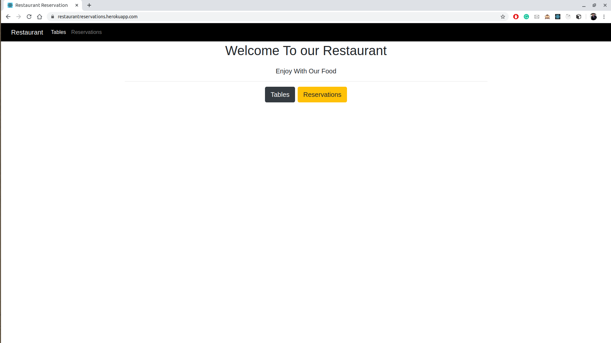

# Restaurant Reservation
* This is a Restaurant Reservation Site that you can reserve a table in a specific time
* This site is developed in node.js(Express), mongoDB and React 

## You Can Do... 
* View all tables.
* Add new table.
* Delete an existing table.
* View all the currently available tables, along with the number of persons for each table.
* Reserve/Book a table.
* View the reservations/bookings for a specific date.

## Install
* you must have nodejs on your machine and you can install it [nodejs](https://nodejs.org/en/download/).
* you must have mongoDB on your machine and you can install it [mongo](https://docs.mongodb.com/manual/installation/).

## Run the project
* 1 ) Download the project.
* 2 ) start mongoDB service.
* 3 ) Enter the project folder.
* 4 ) Run npm install from the command line to install package.json express dependencies. 
* 5 ) Run node . or node  index.js or npm start
* 6 ) Enter the ./client folder.
* 7 )  Run npm install from the command line to install package.json react dependencies. 
* 8 ) Run npm start
* 9 ) Enjoy.

## Testing
* 1 ) You should have mocha on your machine.
* 2 ) Enter the project folder.
* 3 ) Run npm test.

### photo of The Site

###### Home Page

###### all Tables Page

###### Available Tables Page

###### Adding New Table Page

###### Reservations Page

###### add Reservation Page

###### errors Reservation Page

